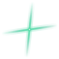
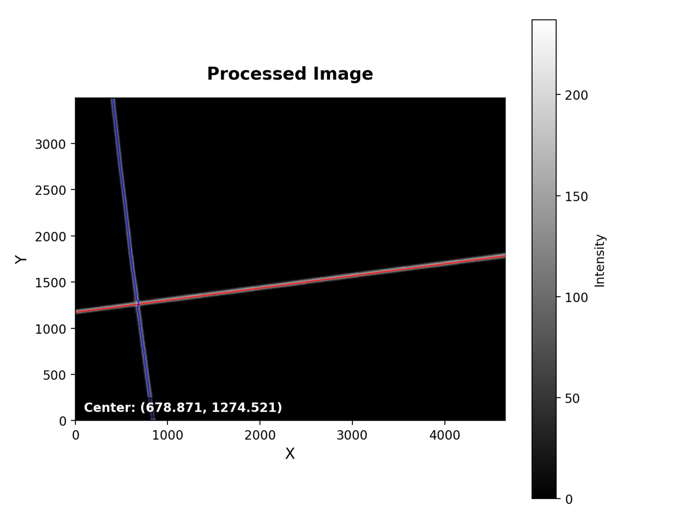
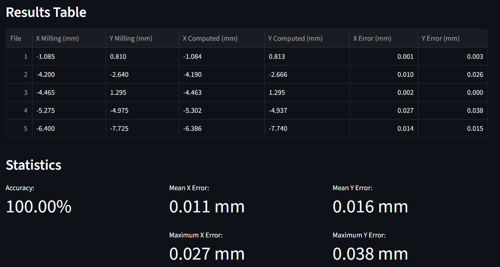
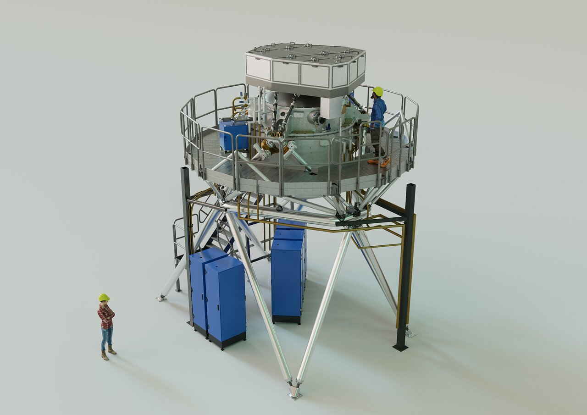
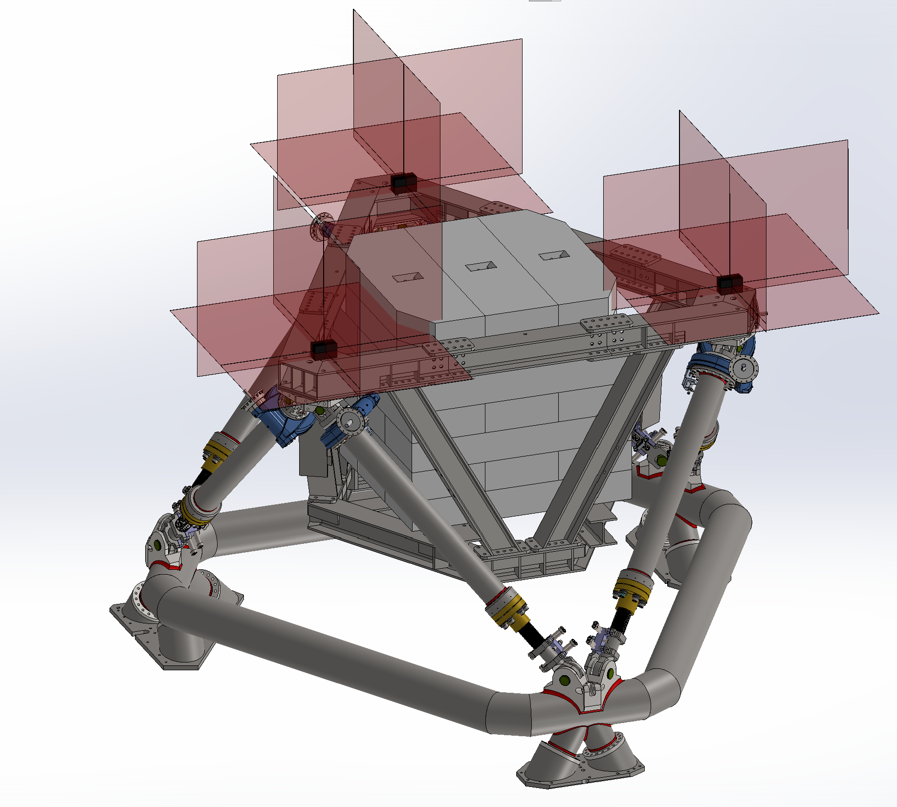

<div align="center">
  
  <h1>MEDIS - High Resolution 3D Measurement System</h1>
  <p>A Python-based image processing pipeline for a High-Resolution 3D Measurement System.</p>
</div>
  
---

## Access

You can access the application online at [MEDIS app](https://medis-measurement-system.streamlit.app) or run it locally by cloning this repository.

> **Note:** Due to camera access restrictions in the online environment, the live camera capture is unavailable. However, you can still test the app using the sample FITS files from the repository located in `files/Calibration_Files/Fits/capture_fits_test`, or clone the repository to run it locally and the camera feature will be available.

## Overview

MEDIS is a Python-based image processing pipeline, **currently under development**, in the context of the [METIS instrument](https://elt.eso.org/instrument/METIS/) for [ESO's Extremely Large Telescope (ELT)](https://elt.eso.org/).



It is designed to detect the **intersection of laser curtains** projected onto fixed targets. The resulting cross pattern, captured by a USB camera, is analyzed to obtain 2D spatial coordinates $(x,y)$ with **sub-50 µm resolution.**

This pipeline will soon be integrated into a full **3D Measurement System**, where 4 cameras capturing different planes will enable complete **XYZ coordinate** reconstruction: 3 for the vertical axes and 1 for the horizontal axis.

---

## Features

* **Image Acquisition:** Capture and storage of frames from multiple cameras in PNG and FITS formats
* **Detection & Analysis:** Automatic detection of cross center and tilt, line fitting on cross arms, distance and angle calculations
* **Calibration:** Pixel-to-mm calibration coefficient estimation from captured images, stored as JSON
* **Result Export:** Output in FITS, PNG, CSV, JSON, and TXT formats
* **Web Interface:** Full interactive operation via Streamlit (capture, calibration, analysis, export)

---

## Interface Pages

The Streamlit sidebar provides access to 4 pages:

* **MEDIS** - Introduction and general project information.
* **Main** - Real-time coordinate acquisition from camera images.
* **Calibration** - Obtain pixel-to-mm calibration coefficients.
* **Debug** - Access intermediate processing steps for validation (image capture, pixel coordinates $(i,j)$ and millimeter coordinates $(x,y)$ from previous frames).

> **Note:** Each page includes **instructions** and interactive elements for user input and result visualization.

---

## Output Example

The table below compares real coordinates (obtained with a milling machine) against coordinates estimated by the system:



> **Note:** Milling machine coordinates (or any reference coordinates used in the calibration) are stored in the FITS file headers. This allows the program to extract reference values and metadata automatically, without relying on external files.

---

## Project Structure

```
MEDIS/
├── files/                          # Generated files
│   ├── Calibration Files/
│   │   ├── coefficients/           # Calibration coefficients (JSON)
│   │   ├── Data/                   # Calibration data (TXT)
│   │   ├── Fits/                   # Raw images (FITS)
│   │   └── Images/                 # Processed images (PNG)
│   ├── Main Files/
│   │   ├── Data/                   # Results History (TXT)
│   │   ├── Fits/                   # Raw images (FITS)
│   │   └── Images/                 # Processed images (PNG)
│   │
│   └── Tables_Figures/             # Figures and tables for documentation
│
├── pages/                          # Streamlit pages
│   ├── 1_Main.py                   # Continuous image capture and results
│   ├── 2_Calibration.py            # Calibration
│   └── 3_Debug.py                  # Debug and intermediate validation
│
├── src/                            # Support modules
│   ├── camera.py                   # Image capture and Processing
│   ├── compute_calibration.py      # Compute cross center and pixel-to-mm conversion
│   ├── paths.py                    # Directory path definitions
│   ├── styles.py                   # Streamlit interface styles
│   └── utils.py                    # Auxiliary functions for processing and fitting
│
├── MEDIS.py                        # Introduction page
├── requirements.txt                # Project dependencies
├── .gitignore
└── README.md
```

> **Data organisation:** All generated files are automatically organised into timestamped subfolders within `files/`. Test files (FITS, images, calibration coefficients...) are included in `files/Calibration Files/`.

---

## Scientific Context



**METIS** (Mid-infrared ELT Imager and Spectrograph) will be one of the first-generation instruments on ESO's Extremely Large Telescope (ELT). The Warm Support Structure (WSS), **developed in Portugal**, is a critical subsystem providing support and alignment for METIS components. One of its key elements is the **Cryostat Alignment Structure (CAS)**, a movable hexapod that holds the cryostat and attached instruments.

To ensure scientific performance and instrument integrity, **highly accurate position measurements** are required during assembly and integration. To meet this requirement, **MEDIS** is being developed as a **portable, high-resolution alternative** to conventional metrology techniques such as coordinate measuring machines (CMMs), total stations, and laser trackers.

For more information: [Final design of the ELT's METIS instrument completed](https://www.eso.org/public/unitedkingdom/announcements/ann24007/?lang=en)

<br clear="right">

## Hardware Setup



The 3D Measurement System consists of:

- **3 laser curtain devices**, each projecting three orthogonal planar beams that form a cross on the targets.
- **4 USB cameras** capturing images of the laser crosses: 3 for the vertical axis, 1 for the horizontal axis, enabling full XYZ reconstruction.
- **Fixed targets** mounted on the integration walls, used as reference surfaces for the laser intersections.

<br clear="left">
